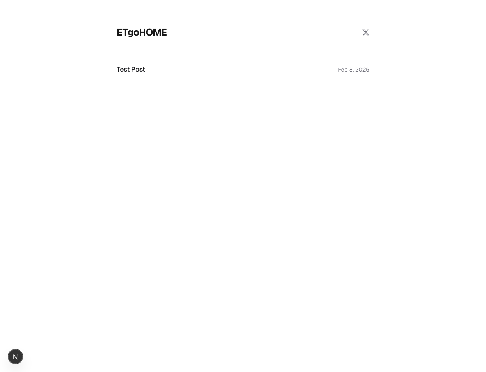
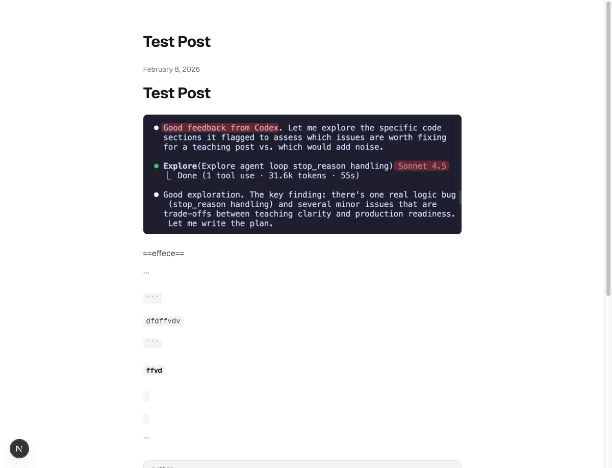
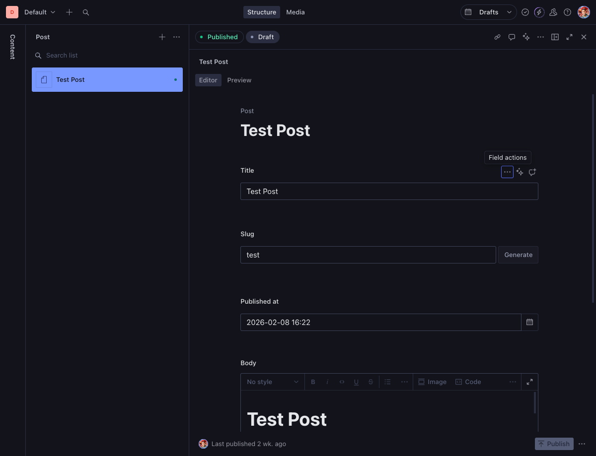

# blog-sanity-nextjs-experiment

> **Archived.** This repo documents a completed experiment. It is read-only.

A personal blog experiment wiring **Next.js 16 + Sanity CMS + Vercel** together. Built in early 2026 to evaluate whether a headless CMS workflow would fit for personal blogging.

## What This Was

- **Frontend:** Next.js 16 (App Router), Tailwind CSS v4, TypeScript, Geist font
- **CMS:** [Sanity](https://sanity.io) — content hosted in Sanity's cloud, edited via an embedded Studio at `/studio`
- **Deployment:** Vercel (with Web Analytics)
- **Sanity plugins installed:** `@sanity/code-input`, `@sanity/table`, `@sanity/assist` (AI), `sanity-plugin-media`, `sanity-plugin-iframe-pane` (live preview), `sanity-plugin-markdown`

The studio was embedded directly in the Next.js app and served from `/studio`, with posts fetched from Sanity's API at render time.

## Why It's Archived

After hands-on use, the Sanity CMS workflow isn't the right fit for personal blogging:

- **Content lives in the cloud, not in the repo.** Sanity stores content in their hosted database. Posts aren't files — they're API responses. No local editing without network access.
- **Studio friction.** Even for local development, you need to register the studio with Sanity's cloud (CORS whitelist) before it can access content.
- **Overhead for solo use.** Schema definitions, GROQ queries, API tokens, plugin configuration — worthwhile for teams, overkill for one person writing occasional posts.
- **Preferred workflow:** Hugo + plain Markdown files, edited in Obsidian or an IDE, committed directly to the repo. Zero external services, zero CMS overhead.

## Screenshots

### Blog home (post listing)

### Sample post (Sanity-rendered content)

### Sanity Studio (embedded CMS editor)

The studio requires registering with Sanity's cloud even for local development — illustrating the CMS overhead.

## What's Next

Sticking with the Hugo-based workflow for the personal blog. Might try [Astro](https://astro.build) in the future as a static-site alternative with better component flexibility.

## Tech Stack (for reference)

| Layer | Technology |
|-------|-----------|
| Framework | Next.js 16 (App Router) |
| CMS | Sanity v3 |
| Styling | Tailwind CSS v4 |
| Fonts | Geist (Vercel) |
| Deployment | Vercel |
| Analytics | Vercel Web Analytics |
